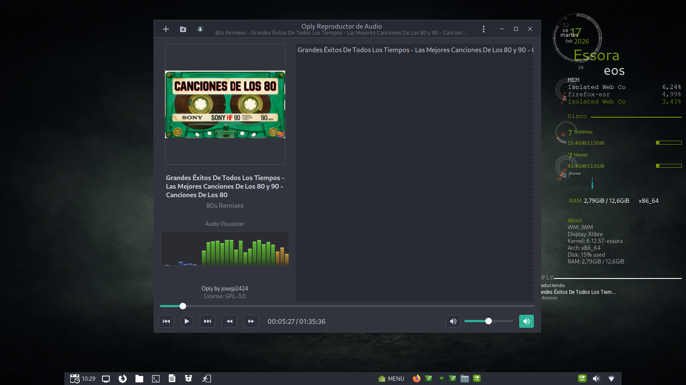

# oply-player
Music & video player with YouTube audio/video downloader (yt-dlp auto-updated).

<p align="center">
  
</p>

Oply Player is a GTK3 multimedia suite created by **josejp2424**. It includes a music player, a video player, and a YouTube audio/video downloader in a single, consistent interface.

## Components

- **Oply**: music player (playlists, queue, basic controls).
- **Oply Video**: video player.
- **Oply Convert**: YouTube audio/video download + conversion (yt-dlp + FFmpeg).

## Note about yt-dlp

This repository **does not ship yt-dlp**.

- On first run, **Oply Convert** will offer to install it if it is missing.
- You can also use the **“Update yt-dlp”** button.

Oply Convert downloads the latest **official** `yt-dlp_linux` release and installs it to:

`/usr/local/Oply/bin/yt-dlp`

The install/update requires Internet access and will ask for admin permission (via the included GTK password prompt helper).

## Downloading music/video (Oply Convert)

1. Copy the YouTube video URL.
2. Paste it into **Oply Convert**.
3. Choose the output format (e.g. **mp3**, **wav**, **mp4**, **avi**, etc.).
4. Click **Convert** to download and convert.

Oply Convert uses **yt-dlp** for downloading and **FFmpeg** for conversion.

## Dependencies (Debian/Devuan)

Core runtime dependencies:

```bash
sudo apt update
sudo apt install -y \
  python3 python3-gi gir1.2-gtk-3.0 \
  python3-cairo python3-gi-cairo \
  gir1.2-gdkpixbuf-2.0 librsvg2-common \
  mpv ffmpeg \
  sudo ca-certificates
```

Tray icon support (recommended):

```bash
sudo apt install -y gir1.2-ayatanaappindicator3-0.1 libayatana-appindicator3-1
```

Python MPV binding for **Oply Video** (recommended if available in your repo):

```bash
sudo apt install -y python3-mpv
```

If your repository does not provide `python3-mpv`, you can install the upstream binding:

```bash
python3 -m pip install --user python-mpv
```

## Install (from this repository)

This repo keeps the original Essora paths:

- App files: `/usr/local/Oply/`
- Desktop entries: `/usr/share/applications/`
- Helper tool: `/usr/local/bin/oply_status.py`
- CLI launchers: `/usr/local/bin/oply`, `/usr/local/bin/oply-video`, `/usr/local/bin/oply-convert`

Install:

1. `cd /path/to/package`
2. `sudo make install`

Uninstall:

- `sudo make uninstall`

## Usage

Launch from the application menu: **Oply**, **Oply Video**, **Oply Convert**  
Or from terminal:

```bash
oply
oply-video
oply-convert
```

## Conky integration (optional)

Oply exports the current playback status to:

`~/.config/oply/now_playing.json`

You can print it in Conky with:

```bash
oply_status.py
```

## License

GPL-3.0. See headers in each source file.
