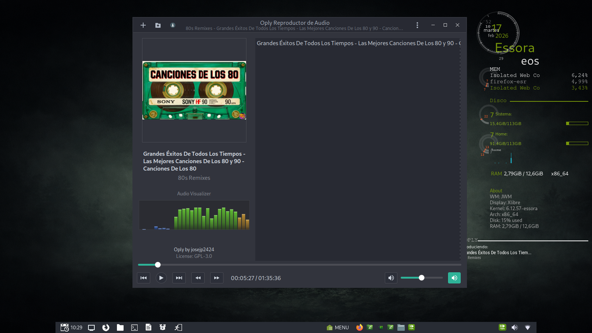

# oply-player

Music & video player suite with YouTube audio/video downloader (yt-dlp auto-updated).

<p align="center">
  
</p>

**Oply Player** is a GTK3 multimedia suite created by **josejp2424**.  
It includes a music player (**Oply**), a video player (**Oply Video** with IPTV/TV News), an Internet radio player (**Oply Radio**), and a YouTube downloader/converter (**Oply Convert**) in a consistent interface.

---

## Components

- **Oply (Audio Player)**  
  Local music player with playlists, queue, and basic controls.

- **Oply Video (Video Player + IPTV/TV News)**  
  Video player plus IPTV/TV News browsing with country/locale indexed lists.

- **Oply Radio (Internet Radio)**  
  Online radio player with country/locale station lists, favorites, and tray minimize.

- **Oply Convert (YouTube Downloader/Converter)**  
  Download and convert YouTube audio/video using **yt-dlp** and **FFmpeg**.

---

## Quick Install (Recommended)

### Option A — Install the .deb (Debian/Devuan)

Download the latest `.deb` from GitHub Releases, then:

```bash
sudo dpkg -i oply-player_2.2-1_amd64.deb
sudo apt -f install
```

### Option B — Install from tar.gz

Download the `.tar.gz` from GitHub Releases and extract it:

```bash
sudo tar -xzf oply-player_2.2.tar.gz -C /
```

---

## Dependencies (Debian/Devuan)

Core runtime dependencies:

```bash
sudo apt update
sudo apt install -y \
  python3 python3-gi gir1.2-gtk-3.0 \
  python3-cairo python3-gi-cairo \
  python3-pillow python3-mutagen python3-matplotlib \
  gir1.2-gdkpixbuf-2.0 librsvg2-common \
  mpv ffmpeg socat pulseaudio-utils \
  sudo ca-certificates
```

Tray icon support (recommended):

```bash
sudo apt install -y gir1.2-ayatanaappindicator3-0.1 libayatana-appindicator3-1
```

Python MPV binding for **Oply Video** (recommended if available in your repo):

```bash
sudo apt install -y python3-mpv
```

If your repository does not provide `python3-mpv`, you can install the upstream binding:

```bash
python3 -m pip install --user python-mpv
```

---

## Install (from source repository)

This repo keeps the original Essora paths:

- App files: `/usr/local/Oply/`
- Desktop entries: `/usr/share/applications/`
- Helper tool: `/usr/local/bin/oply_status.py`
- CLI launchers:
  - `/usr/local/bin/oply`
  - `/usr/local/bin/oply-video`
  - `/usr/local/bin/oply-convert`
  - `/usr/local/bin/oply_radio`

Install:

```bash
cd /path/to/oply-player
sudo make install
```

Uninstall:

```bash
sudo make uninstall
```

---

## Usage

Launch from the application menu:

- **Oply**
- **Oply Video**
- **Oply Radio**
- **Oply Convert**

Or run from terminal:

```bash
oply
oply-video
oply_radio
oply-convert
```

---

## Note about yt-dlp

This repository **does not ship yt-dlp**.

- On first run, **Oply Convert** will offer to install it if it is missing.
- You can also use the **“Update yt-dlp”** button.

Oply Convert downloads the latest **official** `yt-dlp_linux` release and installs it to:

`/usr/local/Oply/bin/yt-dlp`

The install/update requires Internet access and will ask for admin permission (via the included GTK password prompt helper).

---

## Downloading music/video (Oply Convert)

1. Copy the YouTube video URL.
2. Paste it into **Oply Convert**.
3. Choose the output format (e.g. **mp3**, **wav**, **mp4**, **avi**, etc.).
4. Click **Convert** to download and convert.

Oply Convert uses **yt-dlp** for downloading and **FFmpeg** for conversion.

---

## IPTV / TV News (Oply Video)

Oply Video includes an IPTV/TV News browser with country/locale indexed lists.

- The TV channel selector opens in a **separate window** so playback stays full-width.
- During stream startup, Oply shows a **“Connecting…”** message to give feedback while buffering/black screen.
- User TV lists and indexes are stored per-user under:

`~/.config/oply/`

(No root paths are used for user lists.)

---

## Radio (Oply Radio)

Oply Radio includes:

- Country/locale station lists
- Favorites (add/remove with **right-click**)
- Favorites accessible from the **heart** button and from the country selector (**★ Favorites**)
- Tray minimize support

Favorites are stored in:

`~/.config/oply/radio/favorites.json`

---

## Conky integration (optional)

Oply exports the current playback status to:

`~/.config/oply/now_playing.json`

You can print it in Conky with:

```bash
oply_status.py
```

Add this line to your Conky config (`~/.conkyrc` or your Conky theme file) to show the current playing track:

```conky
${execpi 1 python3 /usr/local/bin/oply_status.py}
```

---

## License

GPL-3.0. See headers in each source file.

---

## Links

Homepage: https://sourceforge.net/projects/essora/
